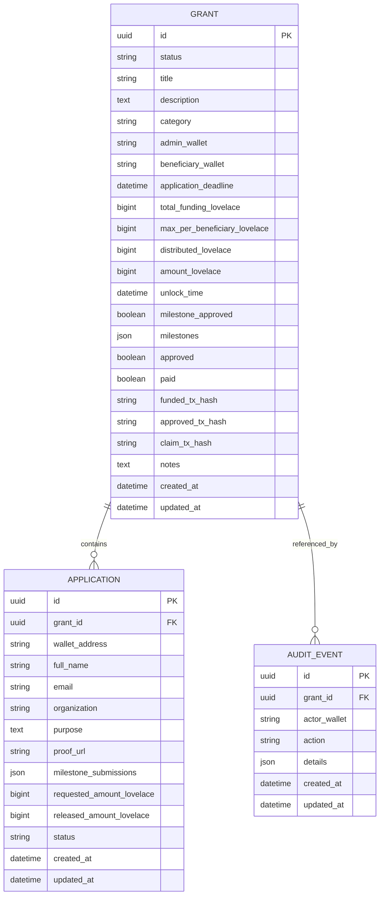

# GrantFlow ERD

## Entity Relationship Diagram

## Relationship Notes

- `GRANT -> APPLICATION` is one-to-many.
- `APPLICATION.grant_id` uses `on_delete=CASCADE`.
- Deleting a grant deletes all linked applications.
- `GRANT -> AUDIT_EVENT` is one-to-many.
- `AUDIT_EVENT.grant_id` is nullable, so some audit events may be global.
