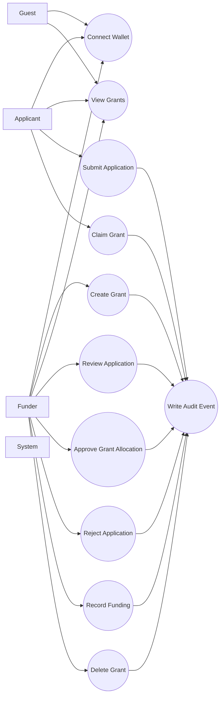

# GrantFlow Use Cases

## Actors

- `Guest`: Unconnected wallet user.
- `Applicant`: Wallet that submits applications.
- `Funder`: Wallet that creates/manages grants.
- `System`: Backend services, validation, and audit logging.

## Use Case Diagram

## Core Use Cases

### UC-01 Connect Wallet

- Actor: Guest, Applicant, Funder
- Preconditions: Lace extension installed.
- Main flow:
1. User clicks connect.
2. Lace prompts for permission.
3. App stores connection and wallet address.
- Postconditions: Wallet state is active in UI.

### UC-02 Create Grant

- Actor: Funder
- Preconditions: Wallet connected; role is not applicant.
- Main flow:
1. Funder enters grant details and milestones.
2. Frontend sends `POST /api/grants/`.
3. Backend stores grant and audit event.
- Postconditions: New grant is visible.

### UC-03 Submit Application

- Actor: Applicant
- Preconditions: Wallet connected; selected grant exists; wallet is not grant creator.
- Main flow:
1. Applicant fills profile, amount, and evidence.
2. Frontend sends `POST /api/applications/`.
3. Backend validates and saves application.
- Postconditions: Application status is `pending`.

### UC-04 Review Application

- Actor: Funder
- Preconditions: Wallet connected; funder owns target grant.
- Main flow:
1. Funder initiates approve/reject action.
2. Lace prompts for signature confirmation.
3. Frontend sends review API call.
4. Backend verifies ownership and updates status.
- Postconditions: Application becomes `approved` or `rejected`.

### UC-05 Approve Grant Allocation

- Actor: Funder
- Preconditions: Funder owns selected grant; valid unlock time and amount.
- Main flow:
1. Funder approves application details.
2. Frontend signs approval payload.
3. Frontend calls `POST /api/grants/<id>/approve/`.
4. Frontend calls `POST /api/applications/<id>/review/` with `approved`.
- Postconditions: Grant and application approval states are updated.

### UC-06 Record Funding

- Actor: Funder
- Preconditions: Funder owns grant; wallet connected.
- Main flow:
1. Frontend builds and submits contract funding transaction.
2. Frontend records tx hash with `POST /api/grants/<id>/record-funding/`.
- Postconditions: Grant status updates to funded state.

### UC-07 Claim Grant

- Actor: Applicant
- Preconditions: Wallet matches beneficiary; unlock time reached; claimable checks pass.
- Main flow:
1. Applicant runs claim action.
2. Frontend submits claim transaction.
3. Frontend records claim via `POST /api/grants/<id>/record-claim/`.
- Postconditions: Grant marked claimed; released amount updated.

### UC-08 Delete Grant

- Actor: Funder
- Preconditions: Wallet connected; wallet is the creator of that grant.
- Main flow:
1. Funder confirms delete in UI.
2. Frontend calls `DELETE /api/grants/<id>/delete/` with `admin_wallet`.
3. Backend verifies ownership.
4. Backend deletes grant and related applications.
- Postconditions:
1. Grant is removed.
2. Linked applications are removed.
3. `GRANT_DELETED` audit event is recorded.

## Security-Critical Rules

- Non-owner wallets cannot manage, review, fund, or delete grants they did not create.
- Applicant wallets cannot create/manage grants as funders.
- Backend enforces ownership checks even if frontend is bypassed.
